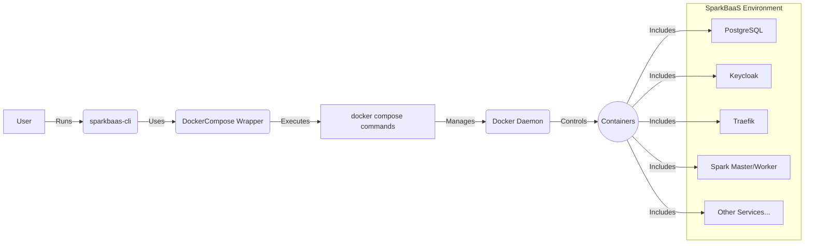

# SparkBaaS Application Architecture

This document provides an overview of the SparkBaaS platform architecture to help contributors understand the structure, components, and interactions.

## Overview

SparkBaaS is a "Backend as a Service" platform built primarily with Python and containerized using Docker. It is designed to provide backend functionalities, likely leveraging Apache Spark for data processing tasks (inferred from the name). The entire platform is managed and orchestrated via a dedicated Command Line Interface (CLI) tool (`sparkbaas-cli`), which interacts with Docker Compose to manage the various services. The architecture emphasizes modularity, ease of management through the CLI, and environment consistency via containerization.

## Core Technologies

-   **Python**: Primary language for the CLI tool and potentially backend services.
-   **Docker**: Containerization platform for all services.
-   **Docker Compose**: Tool for defining and running the multi-container SparkBaaS environment.
-   **PySpark**: (Strongly inferred) Python API for Apache Spark, likely used for core data processing capabilities.
-   **PostgreSQL**: Relational database service, likely used for metadata, configuration, or application data. (Inferred from `src/compose/postgres/`)
-   **Keycloak**: Identity and Access Management service for authentication and authorization. (Inferred from `src/compose/keycloak/`)
-   **Traefik**: Cloud Native Networking Stack (Reverse Proxy, Load Balancer) to manage ingress and routing to services. (Inferred from `src/compose/traefik/`)
-   **Rich**: Python library for rich text and beautiful formatting in the terminal (used by the CLI).
-   **argparse**: Python library for command-line option, argument, and sub-command parsing (used by the CLI).

## Directory Structure

```
sparkbaas-main/
├── .github/              # GitHub Actions workflows, issue/PR templates, etc.
├── docs/                 # Project documentation (ARCHITECTURE.md, PRD.md, etc.)
├── src/                  # Source code root
│   ├── compose/          # Docker Compose configurations and related service assets
│   │   ├── .env.template # Template for environment variables
│   │   ├── backup/       # Backup related scripts/configs
│   │   ├── functions/    # Serverless function configurations/code (if applicable)
│   │   ├── keycloak/     # Keycloak configuration files
│   │   ├── postgres/     # PostgreSQL configuration/init scripts
│   │   ├── security/     # Security-related configurations (e.g., certs)
│   │   ├── traefik/      # Traefik configuration files
│   │   ├── docker-compose.yml # Main compose file defining services
│   │   ├── docker-compose.setup.yml # Compose file for setup tasks (optional)
│   │   └── ...           # Other service-specific config folders/files
│   └── sparkbaas-cli/    # Source code for the command-line interface
│       ├── sparkbaas/    # Main Python package for the CLI
│       │   ├── commands/ # Implementation of CLI commands (init, start, stop, etc.)
│       │   ├── core/     # Core CLI logic (config, compose wrapper, utils)
│       │   ├── ui/       # User interface elements (console output)
│       │   ├── __init__.py
│       │   └── cli.py    # Main CLI entry point script
│       └── ...           # Tests, setup files for the CLI package
├── .dockerignore         # Files/directories to ignore in Docker builds
├── .gitignore            # Files/directories ignored by Git
├── LICENSE.md            # Project license
├── README.md             # Project overview and setup instructions
└── ...                   # Other config files (pyproject.toml, etc.)
```

## Key Components & Services

1.  **SparkBaaS CLI (`sparkbaas-cli`)**:
    *   The primary interface for developers/administrators to manage the SparkBaaS environment.
    *   Built with Python (`argparse`, `rich`).
    *   Provides commands like `init`, `start`, `stop`, `status`, `reset`, `migrate`, `backup`, `restore`, `function`, `upgrade`.
    *   Uses the `DockerCompose` wrapper ([`src/sparkbaas-cli/sparkbaas/core/compose.py`](src/sparkbaas-cli/sparkbaas/core/compose.py)) to execute `docker compose` commands against the configuration in `src/compose/`.

2.  **Docker Compose Orchestration (`src/compose/`)**:
    *   Defines the services, networks, and volumes that constitute the SparkBaaS platform.
    *   Key services likely defined in `docker-compose.yml`:
        *   **PostgreSQL**: Data persistence.
        *   **Keycloak**: Authentication/Authorization.
        *   **Traefik**: Ingress/Routing.
        *   **Spark Master/Worker(s)**: Core Spark cluster (inferred).
        *   **API Service(s)**: Potential custom services exposing BaaS features (inferred).
        *   **Function Runtime**: Service to execute user-defined functions (inferred from `function` command).
    *   Uses `.env` files (generated from `.env.template`) for environment-specific configuration.

3.  **Core Services (Containerized)**:
    *   **PostgreSQL**: Stores relational data. Managed via compose, potentially initialized with scripts in `src/compose/postgres/`.
    *   **Keycloak**: Manages users, roles, and authentication flows. Configured via files in `src/compose/keycloak/`.
    *   **Traefik**: Routes external traffic to the appropriate backend services based on rules defined in `src/compose/traefik/` and Docker labels. Handles TLS termination.
    *   **Spark Cluster**: (Assumed) Consists of Spark Master and Worker containers providing the distributed processing engine.

## Interaction Flow (CLI Management)



## Configuration

-   Environment-specific settings are managed via an `.env` file in the project root, typically generated from `.env.template` using a script like `generate-env.sh`.
-   The CLI's `Config` class ([`src/sparkbaas-cli/sparkbaas/core/config.py`](src/sparkbaas-cli/sparkbaas/core/config.py)) likely loads and provides access to these settings.
-   Service-specific configurations reside within their respective directories under `src/compose/`.

## Extending the Platform

-   **New CLI Commands**: Add new modules to `src/sparkbaas-cli/sparkbaas/commands/` and register them in `src/sparkbaas-cli/sparkbaas/cli.py`.
-   **New Services**: Define the service in `src/compose/docker-compose.yml`, add necessary configuration files under `src/compose/`, and potentially update the CLI to manage it if needed.